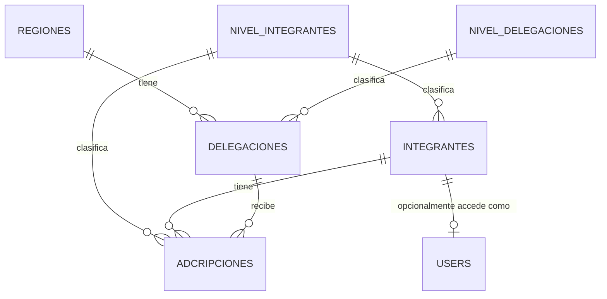

# Base de Datos: SIES56

Documentación técnica del esquema de base de datos (`sies56`), generada a partir del dump SQL actual. Incluye únicamente las tablas de dominio del negocio; se omiten las tablas de infraestructura de Laravel (`cache`, `cache_locks`, `jobs`, `job_batches`, `failed_jobs`, `migrations`, `sessions`, `password_reset_tokens`) y `activity_log` (paquete Spatie Activitylog).

---

## 1. Diagrama de Relaciones

---

## 2. Tablas

### `regiones`
Catálogo de las 11 regiones territoriales.

| Columna | Tipo | Notas |
|---|---|---|
| `id` | bigint UNSIGNED | PK |
| `nombre` | varchar(255) | Único |
| `sede` | varchar(255) | |
| `created_at` / `updated_at` | timestamp | |

---

### `nivel_delegaciones`
Catálogo de niveles/tipos de delegación (ej. PRIMARIA, BACHILLERATO, TELESECUNDARIA).

| Columna | Tipo | Notas |
|---|---|---|
| `id` | bigint UNSIGNED | PK |
| `nombre` | varchar(255) | Único |
| `created_at` / `updated_at` | timestamp | |

---

### `delegaciones`
Las 246 delegaciones de la Sección 56.

| Columna | Tipo | Notas |
|---|---|---|
| `id` | bigint UNSIGNED | PK |
| `region_id` | bigint UNSIGNED | FK → `regiones.id` |
| `delegacion` | varchar(255) | Único (clave, ej. `D-II-59`) |
| `sede` | varchar(255) | |
| `nivel_delegacion_id` | bigint UNSIGNED | FK → `nivel_delegaciones.id` |
| `created_at` / `updated_at` | timestamp | |

**Relaciones:**
- `region_id` → `regiones.id`
- `nivel_delegacion_id` → `nivel_delegaciones.id`

---

### `nivel_integrantes`
Catálogo de niveles educativos del integrante (ej. PREESCOLAR, PRIMARIAS, TELEBACHILLERATO).

| Columna | Tipo | Notas |
|---|---|---|
| `id` | bigint UNSIGNED | PK |
| `nombre` | varchar(255) | Único |
| `created_at` / `updated_at` | timestamp | |

---

### `integrantes`
Registro unificado y global de la persona (independiente de sus adscripciones).

| Columna | Tipo | Notas |
|---|---|---|
| `id` | bigint UNSIGNED | PK |
| `nombre` | varchar(255) | |
| `apellido_paterno` | varchar(255) | |
| `apellido_materno` | varchar(255) | Nullable |
| `rfc` | varchar(13) | Único, nullable |
| `curp` | varchar(18) | Único, nullable |
| `numero_personal` | varchar(255) | Único, nullable |
| `genero` | enum(`M`,`H`) | |
| `telefono` | varchar(255) | Nullable |
| `email` | varchar(255) | Nullable |
| `nivel_integrante_id` | bigint UNSIGNED | FK → `nivel_integrantes.id` |
| `estatus_global` | varchar(255) | Default `ACTIVO` |
| `created_at` / `updated_at` / `deleted_at` | timestamp | Soft deletes |

**Relaciones:**
- `nivel_integrante_id` → `nivel_integrantes.id`

---

### `adcripciones`
Historial de adscripciones laborales del integrante a una delegación (permite doble adscripción / pluralidad funcional).

| Columna | Tipo | Notas |
|---|---|---|
| `id` | bigint UNSIGNED | PK |
| `integrante_id` | bigint UNSIGNED | FK → `integrantes.id`, `ON DELETE CASCADE` |
| `delegacion_id` | bigint UNSIGNED | FK → `delegaciones.id` |
| `nivel_integrante_id` | bigint UNSIGNED | FK → `nivel_integrantes.id` |
| `funcion` | varchar(255) | Texto libre (ej. DIRECTOR, DOCENTE, INTENDENTE) |
| `fecha_ingreso_sev` | date | Nullable |
| `fecha_ingreso_sindicato` | date | Nullable |
| `estatus_adscripcion` | varchar(255) | Default `ACTIVO` |
| `created_at` / `updated_at` / `deleted_at` | timestamp | Soft deletes |

**Relaciones:**
- `integrante_id` → `integrantes.id` (cascada al eliminar)
- `delegacion_id` → `delegaciones.id`
- `nivel_integrante_id` → `nivel_integrantes.id`

---

### `users`
Cuentas de acceso al sistema. Todo usuario operativo debe estar enlazado a un `integrante`.

| Columna | Tipo | Notas |
|---|---|---|
| `id` | bigint UNSIGNED | PK |
| `integrante_id` | bigint UNSIGNED | FK → `integrantes.id`, nullable, `ON DELETE SET NULL` |
| `name` | varchar(255) | |
| `email` | varchar(255) | Único |
| `email_verified_at` | timestamp | Nullable |
| `password` | varchar(255) | |
| `remember_token` | varchar(100) | Nullable |
| `created_at` / `updated_at` | timestamp | |

**Relaciones:**
- `integrante_id` → `integrantes.id`

---

## 3. Resumen de Foreign Keys

| Tabla | Columna | Referencia | On Delete |
|---|---|---|---|
| `delegaciones` | `region_id` | `regiones.id` | — |
| `delegaciones` | `nivel_delegacion_id` | `nivel_delegaciones.id` | — |
| `integrantes` | `nivel_integrante_id` | `nivel_integrantes.id` | — |
| `adcripciones` | `integrante_id` | `integrantes.id` | CASCADE |
| `adcripciones` | `delegacion_id` | `delegaciones.id` | — |
| `adcripciones` | `nivel_integrante_id` | `nivel_integrantes.id` | — |
| `users` | `integrante_id` | `integrantes.id` | SET NULL |

---

## 4. Notas

- Este documento refleja únicamente lo que existe actualmente en el dump SQL (`sies56.sql`). No incluye funcionalidades descritas en el README de negocio que aún no están modeladas en la base de datos (roles/permisos, motivo de baja, flujo de autorización, etc.). Se actualizará conforme se implementen las migraciones correspondientes.
