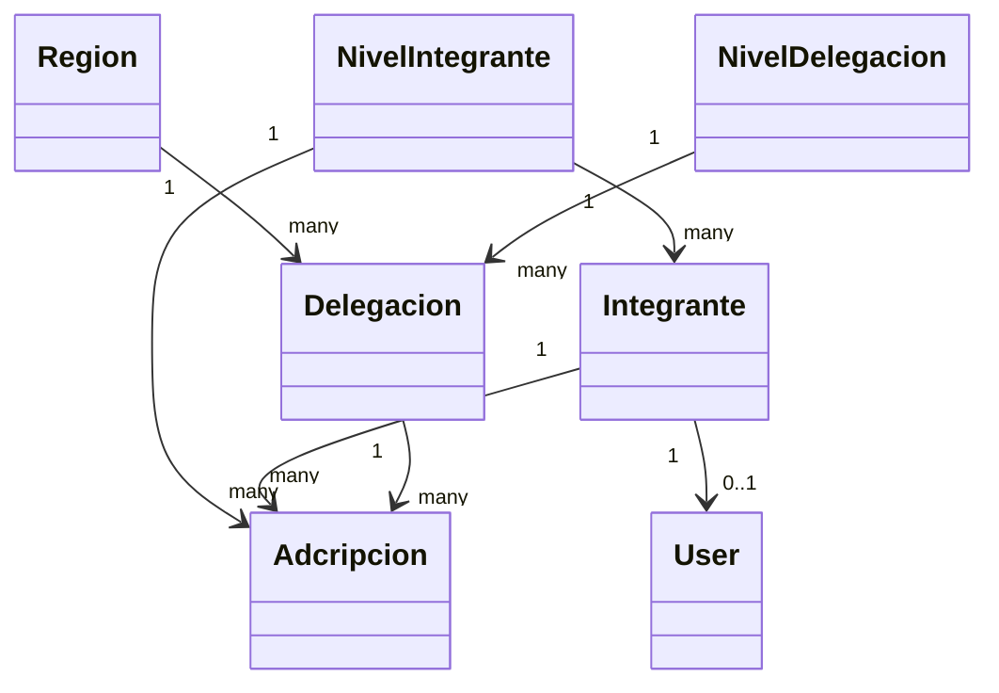

# Modelos Eloquent: SIES56

Documentación de los modelos Eloquent (Laravel 12) correspondientes al esquema en [`DATABASE.md`](./DATABASE.md). Todos los modelos viven en `app/Models`.

---

## `Region`
Tabla: `regiones`

**Fillable:** `nombre`, `sede`

**Relaciones:**
| Método | Tipo | Modelo relacionado |
|---|---|---|
| `delegaciones()` | `hasMany` | `Delegacion` |

---

## `NivelDelegacion`
Tabla: `nivel_delegaciones`

**Fillable:** `nombre`

**Relaciones:**
| Método | Tipo | Modelo relacionado |
|---|---|---|
| `delegaciones()` | `hasMany` | `Delegacion` |

---

## `NivelIntegrante`
Tabla: `nivel_integrantes`

**Fillable:** `nombre`

**Relaciones:**
| Método | Tipo | Modelo relacionado |
|---|---|---|
| `integrantes()` | `hasMany` | `Integrante` |
| `adcripciones()` | `hasMany` | `Adcripcion` |

---

## `Delegacion`
Tabla: `delegaciones`

**Fillable:** `region_id`, `delegacion`, `sede`, `nivel_delegacion_id`

**Relaciones:**
| Método | Tipo | Modelo relacionado |
|---|---|---|
| `region()` | `belongsTo` | `Region` |
| `nivelDelegacion()` | `belongsTo` | `NivelDelegacion` |
| `adcripciones()` | `hasMany` | `Adcripcion` |

---

## `Integrante`
Tabla: `integrantes`
**Traits:** `SoftDeletes`

**Fillable:** `nombre`, `apellido_paterno`, `apellido_materno`, `rfc`, `curp`, `numero_personal`, `genero`, `telefono`, `email`, `nivel_integrante_id`, `estatus_global`

**Accessors:**
| Atributo | Descripción |
|---|---|
| `nombre_completo` | Concatena `nombre` + `apellido_paterno` + `apellido_materno` |

**Relaciones:**
| Método | Tipo | Modelo relacionado |
|---|---|---|
| `nivelIntegrante()` | `belongsTo` | `NivelIntegrante` |
| `adcripciones()` | `hasMany` | `Adcripcion` |
| `user()` | `hasOne` | `User` |

---

## `Adcripcion`
Tabla: `adcripciones`
**Traits:** `SoftDeletes`

**Fillable:** `integrante_id`, `delegacion_id`, `nivel_integrante_id`, `funcion`, `fecha_ingreso_sev`, `fecha_ingreso_sindicato`, `estatus_adscripcion`

**Casts:** `fecha_ingreso_sev` → `date`, `fecha_ingreso_sindicato` → `date`

**Relaciones:**
| Método | Tipo | Modelo relacionado |
|---|---|---|
| `integrante()` | `belongsTo` | `Integrante` |
| `delegacion()` | `belongsTo` | `Delegacion` |
| `nivelIntegrante()` | `belongsTo` | `NivelIntegrante` |

---

## `User`
Tabla: `users`

**Fillable:** `integrante_id`, `name`, `email`, `password`

**Hidden:** `password`, `remember_token`

**Casts:** `email_verified_at` → `datetime`, `password` → `hashed`

**Relaciones:**
| Método | Tipo | Modelo relacionado |
|---|---|---|
| `integrante()` | `belongsTo` | `Integrante` |

---

## Diagrama de Relaciones entre Modelos

---

## Notas

- No se incluyen `activity_log`, ni modelos de roles/permisos, ya que no existen aún en el esquema de base de datos actual.
- Este documento se actualizará conforme se agreguen nuevos modelos o relaciones al proyecto.
